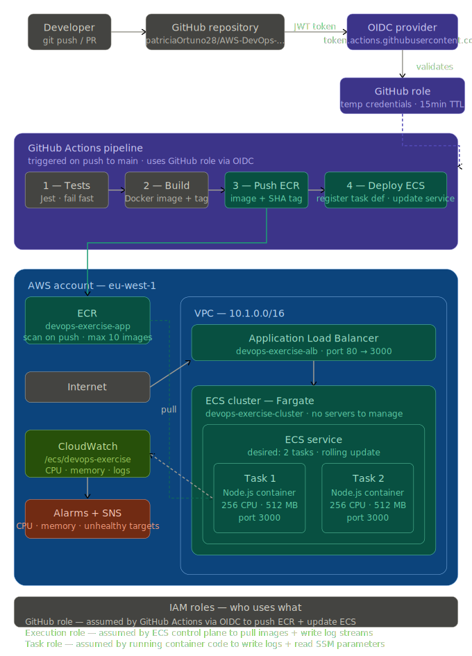

# AWS DevOps Automated Exercise

A hands-on DevOps exercise that builds a complete CI/CD pipeline on AWS from scratch — GitHub Actions, Docker, ECR, and ECS Fargate. Every push to `main` automatically tests, builds, and deploys a containerised Node.js app with zero downtime rolling updates.

> Complements the [AWS Security Automated Exercise](https://github.com/patriciaOrtuno28/AWS-Security-Automated-Exercise). Designed for AWS Certified Developer / Solutions Architect exam prep and real-world DevOps practice.

---

## Architecture overview



---

## Full topology



---

## Prerequisites

- AWS CLI configured (`aws configure`) — default region can be anything, scripts use `--region` explicitly
- Git Bash (Windows) or bash-compatible shell
- Docker installed locally (only needed if you want to build images manually)
- GitHub repository created and cloned
- AWS account — free tier covers most of this exercise

---

## Repository structure

```
AWS-DevOps-Automated-Exercise/
├── config.env                         # Single source of truth
├── menu.sh                            # Interactive control panel
│
├── 01-setup-iam.sh                    # OIDC provider + IAM roles
├── 02-setup-network.sh                # VPC, subnets, security groups
├── 03-setup-ecr.sh                    # ECR repository + lifecycle policy
├── 04-setup-ecs.sh                    # ECS cluster, service, ALB, task definition
├── 05-setup-pipeline.sh               # GitHub Actions secret + verification
├── 06-setup-monitoring.sh             # CloudWatch alarms + SNS
├── 10-deploy-simulation.sh            # Version bump → push → watch pipeline
├── 11-rollback-simulation.sh          # Break app → detect failure → rollback
├── 99-cleanup.sh                      # Delete all resources + restore config
│
├── .github/
│   └── workflows/
│       ├── deploy.yml                 # Push to main → test → build → push → deploy
│       └── pr-check.yml              # PR → test + Docker build only (no deploy)
│
├── app/
│   ├── index.js                       # Express app: /, /health, /info
│   ├── index.test.js                  # Jest tests for all endpoints
│   ├── package.json
│   ├── Dockerfile                     # node:20-alpine, non-root user
│   └── .dockerignore
│
├── ecs/
│   └── task-definition.json           # {{PLACEHOLDER}} template
│
├── ecr/
│   └── lifecycle-policy.json          # Keep last 10 images, expire untagged
│
├── iam/
│   ├── github-oidc-trust-policy.json  # {{AWS_ACCOUNT_ID}} {{GITHUB_ORG}} {{GITHUB_REPO}}
│   ├── github-deploy-policy.json      # ECR push + ECS update + PassRole
│   ├── ecs-execution-trust-policy.json
│   └── ecs-task-policy.json           # CloudWatch logs + SSM read
│
└── img/                               # Architecture SVG diagrams
```

---

## Quick start

```bash
git clone https://github.com/patriciaOrtuno28/AWS-DevOps-Automated-Exercise
cd AWS-DevOps-Automated-Exercise

chmod +x menu.sh
./menu.sh
```

Or run scripts in order:

```bash
./01-setup-iam.sh
./02-setup-network.sh
./03-setup-ecr.sh
./04-setup-ecs.sh
./05-setup-pipeline.sh   # pauses — asks you to add GitHub secret
./06-setup-monitoring.sh

# Then push to main to trigger first deploy
git add . && git commit -m "feat: initial setup" && git push origin main
```

---

## config.env

All scripts read from a single `config.env`. Generated IDs are appended automatically as scripts run — no manual copy-pasting.

```bash
AWS_REGION="eu-west-1"
PROJECT_NAME="devops-exercise"
APP_NAME="devops-app"
APP_PORT="3000"

GITHUB_ORG="patriciaOrtuno28"
GITHUB_REPO="AWS-DevOps-Automated-Exercise"

ECS_CLUSTER_NAME="devops-exercise-cluster"
ECS_CPU="256"
ECS_MEMORY="512"
ECS_DESIRED_COUNT="2"
# ... (generated IDs like VPC_ID, ALB_ARN appended automatically)
```

---

## Phase 1 — Foundation

### 01 — IAM + OIDC

The most important security decision in the whole exercise: **GitHub Actions never stores AWS access keys**.

Instead, AWS and GitHub trust each other via OIDC (OpenID Connect). When a workflow runs, GitHub issues a short-lived JWT token proving "this run is from repo `patriciaOrtuno28/AWS-DevOps-Automated-Exercise`, branch `main`". AWS validates that token against the OIDC provider and issues temporary credentials valid for 15 minutes.

**Four IAM resources created:**

| Resource | Purpose |
|---|---|
| OIDC provider | Registers `token.actions.githubusercontent.com` as a trusted identity source |
| GitHub role | The role GitHub Actions assumes — scoped to your specific repo only |
| Deploy policy | Grants: ECR push, ECS register task definition + update service, IAM PassRole |
| ECS execution role | Used by ECS control plane to pull images from ECR and write CloudWatch log streams |
| ECS task role | Used by the running container — write logs, read SSM parameters |

**OIDC vs access keys — exam distinction:**

| | Access keys | OIDC |
|---|---|---|
| Stored in GitHub | Yes (Secrets) | No |
| Expiry | Never (manual rotation) | 15 minutes (automatic) |
| Scope | Account-wide | Specific repo + branch |
| Rotation risk | High (if leaked, valid indefinitely) | None (token expires before it can be misused) |

> **Note:** The OIDC provider (`token.actions.githubusercontent.com`) is account-level and shared. If you already have it from another project, the script skips creation. The `99-cleanup.sh` deliberately does NOT delete it.

JSON templates: `iam/github-oidc-trust-policy.json`, `iam/github-deploy-policy.json`, `iam/ecs-task-policy.json`

---

### 02 — Network

Two public subnets in different AZs from the start — required by both the ALB (needs 2 AZs) and ECS service high availability.

**Key pattern — Security Group chaining:**

```
Internet → ALB SG (inbound 80/443 from 0.0.0.0/0)
                 ↓
           ECS SG (inbound 3000 from ALB SG only)
```

The ECS security group source is the ALB security group ID — not a CIDR range. This means containers are unreachable directly from the internet, even if someone discovers their private IP.

| Resource | CIDR / Config |
|---|---|
| VPC | `10.1.0.0/16` |
| Subnet 1 | `10.1.1.0/24` — `eu-west-1a` |
| Subnet 2 | `10.1.2.0/24` — `eu-west-1b` |
| ALB SG | Inbound 80 + 443 from `0.0.0.0/0` |
| ECS SG | Inbound 3000 from ALB SG only |

---

### 03 — ECR

Private Docker registry inside your AWS account.

**Lifecycle policy** — without it, every deploy creates a new image and storage costs grow indefinitely. Two rules:
- Keep the last 10 images tagged with `sha-` prefix (the SHA-tagged images pushed by the pipeline)
- Delete untagged images after 1 day (intermediate build artifacts)

**Scan on push** — every pushed image is automatically scanned against the Amazon Inspector CVE database. Results appear in ECR under each image's details.

JSON template: `ecr/lifecycle-policy.json`

---

### 04 — ECS Fargate

The full compute layer in one script.

**Task definition** — the recipe for a container. Defines the image URI, CPU/memory allocation, environment variables, port mappings, log driver, and health check command. Stored as a versioned resource in ECS — every deploy creates a new revision.

```json
{
  "cpu": "256",
  "memory": "512",
  "containerDefinitions": [{
    "image": "<account>.dkr.ecr.eu-west-1.amazonaws.com/devops-exercise-app:latest",
    "healthCheck": {
      "command": ["CMD-SHELL", "curl -f http://localhost:3000/health || exit 1"],
      "startPeriod": 60
    }
  }]
}
```

**ECS service** — keeps `desired: 2` tasks running at all times. Rolling update configuration:
- `minimumHealthyPercent: 50` — at least 1 task must be healthy during deploy
- `maximumPercent: 200` — can temporarily run 4 tasks (2 old + 2 new)

**Fargate vs EC2 launch type — exam distinction:**

| | Fargate | EC2 |
|---|---|---|
| Server management | None | You manage EC2 instances |
| Scaling | Per-task CPU/memory | Per-instance |
| Target type (ALB) | `ip` (container IP) | `instance` (EC2 ID) |
| Cost | Higher per task | Lower if instances are full |
| Patching | AWS handles OS | You handle OS |

JSON template: `ecs/task-definition.json`

---

### 05 — GitHub Actions pipeline

**`deploy.yml`** — triggers on push to `main` when files under `app/` change:

```
test job
  └── setup-node → npm install → jest --coverage

build-and-deploy job (needs: test)
  └── configure-aws-credentials (OIDC)
  └── ecr-login
  └── docker build + tag sha-<commit> + push
  └── download current task definition
  └── render new task definition with updated image
  └── deploy to ECS (wait for stability)
```

**`pr-check.yml`** — triggers on pull requests:
```
test job
  └── jest tests

build-check job (needs: test)
  └── docker build (no push, no deploy)
  └── prints image size
```

**GitHub Secret required:**

```
Name:  AWS_DEPLOY_ROLE_ARN
Value: arn:aws:iam::<account-id>:role/devops-exercise-github-role
```

Add at: `github.com/<org>/<repo>/settings/secrets/actions`

---

### 06 — Monitoring

Four CloudWatch alarms all pointing to the `devops-exercise-alerts` SNS topic:

| Alarm | Metric | Threshold |
|---|---|---|
| CPU high | `AWS/ECS CPUUtilization` | > 80% for 5 min |
| Memory high | `AWS/ECS MemoryUtilization` | > 80% for 5 min |
| Unhealthy targets | `AWS/ApplicationELB UnHealthyHostCount` | > 0 for 2 min |
| Zero running tasks | `ECS/ContainerInsights RunningTaskCount` | < 1 for 1 min |

To receive email notifications:
```bash
source config.env
aws sns subscribe --region eu-west-1 \
  --topic-arn "${SNS_ARN}" \
  --protocol email \
  --notification-endpoint your@email.com
```

---

## Phase 2 — Simulation

### 10 — Deploy simulation

Demonstrates a complete zero-downtime deploy cycle:

1. Automatically bumps `APP_VERSION` in `config.env` (e.g. `1.0.0` → `1.0.1`)
2. Commits and pushes to `main`
3. GitHub Actions pipeline fires: tests → Docker build → ECR push → ECS update
4. Polls `http://<ALB_DNS>` every 15 seconds until the new version appears in the JSON response
5. Reports before/after versions

Total time: ~5–8 minutes end to end.

### 11 — Rollback simulation

Demonstrates ECS rollback without a full pipeline run:

1. Injects a bug — `/health` returns 500 instead of 200
2. Pushes the broken version (pipeline deploys it to ECS)
3. ECS health checks fail — tasks are marked unhealthy
4. Manual rollback: `aws ecs update-service --task-definition <family>:<previous_revision>`
5. ECS replaces broken tasks with the previous known-good revision
6. Restores `app/index.js` and pushes the fix

**Key insight:** ECS stores every task definition revision permanently. A rollback is just pointing the service at an older revision — no rebuild, no pipeline run, ~2 minutes.

```bash
# The rollback command (done automatically by the script)
aws ecs update-service \
  --cluster devops-exercise-cluster \
  --service devops-exercise-service \
  --task-definition devops-exercise-task:3 \   # ← previous good revision
  --force-new-deployment
```

---

## Phase 3 — Cleanup

```bash
./99-cleanup.sh
# Type 'borrar' to confirm
```

Deletes in dependency order:

1. ECS service (scale to 0 first) + task definitions + cluster
2. ALB listener → ALB → target group
3. CloudWatch alarms + log group
4. SNS topic
5. ECR repository (all images, `--force`)
6. IAM roles + deploy policy (**OIDC provider preserved**)
7. Security groups → subnets → IGW → route tables → VPC
8. Restores `config.env` to original state
9. Restores `ecs/task-definition.json` to `{{PLACEHOLDER}}` state

---

## Rolling update — how it works

When GitHub Actions calls `aws ecs update-service` with a new task definition:

```
Before:  [Task A v1] [Task A v1]          (2 running, 0 pending)

Step 1:  [Task A v1] [Task A v1]          (start new task)
         [Task B v2 starting...]           → 3 tasks (150%)

Step 2:  [Task A v1] [Task A v1]          (new task passes health check)
         [Task B v2 healthy]               → ALB starts routing to v2

Step 3:  [Task A v1] [Task B v2]          (drain and stop one old task)
                                           → 2 tasks again

Step 4:  [Task B v2] [Task B v2]          (all old tasks replaced)
         → Deploy complete, zero downtime
```

The ALB health check (`GET /health`) must return 200 before a task is considered healthy. The `startPeriod: 60` gives the container 60 seconds to start before health checks begin.

---

## Known issues

**Git Bash path conversion (Windows):** Any string starting with `/` passed directly to the AWS CLI is converted to a Windows path. Always store paths in variables first:
```bash
HC_PATH="/health"
--health-check-path "${HC_PATH}"    # correct
--health-check-path /health         # mangled by Git Bash
```

**Newline missing in config.env:** Using `echo "KEY=VALUE" >> config.env` without a trailing newline on the last line causes values to concatenate. Use `printf "\nKEY=VALUE\n"` instead.

**ECS service shows 0 running tasks after step 04:** Expected. The task definition references `ECR_URI:latest` but no image exists yet. ECS will keep retrying. Once GitHub Actions pushes the first image, ECS detects the update automatically.

**`wait-for-service-stability` takes 10–15 minutes on first deploy:** Normal. ECS waits for both tasks to pass the health check. The 60-second `startPeriod` in the task definition adds time.

---

## Cost estimate

| Service | Usage in this exercise | Free tier | Monthly cost |
|---|---|---|---|
| ECS Fargate | 2 tasks × 256 CPU × 512 MB | None | ~$0.015/hr = ~$11/month |
| ALB | 1 load balancer | 750 hrs free | ~$0 first month |
| ECR | ~10 images × ~50 MB | 500 MB free | ~$0 |
| CloudWatch | 4 alarms + log group | 10 alarms free | ~$0 |
| VPC / Subnets / IGW | Standard networking | Free | $0 |
| GitHub Actions | Public repo | Free (2000 min/month) | $0 |
| **Total** | | | **~$0–11/month** |

> **Important:** ECS Fargate tasks incur cost whenever they are running, even if idle. Run `./99-cleanup.sh` when you finish the exercise to avoid ongoing charges. The ALB also costs ~$0.008/hr after the free tier expires.

**Cost to run the full exercise once (a few hours):** less than $0.50.

---

## Exam quick-reference

| Topic | Key point |
|---|---|
| OIDC vs access keys | OIDC = no stored secrets, 15-min TTL, repo-scoped. Access keys = long-lived, account-wide risk |
| Fargate vs EC2 launch type | Fargate = serverless, ALB target type `ip`. EC2 = manage instances, target type `instance` |
| ECS task definition | Versioned recipe: image, CPU, memory, ports, env vars, log driver, health check |
| ECS service | Keeps N tasks running, handles rolling deploys, integrates with ALB |
| Rolling update | min 50% healthy + max 200% — old tasks drained only after new tasks pass health check |
| ECS rollback | Point service at previous task definition revision — no rebuild needed |
| ECR lifecycle policy | Prevent unbounded image accumulation — rules on tag prefix + count or age |
| SG chaining | ECS SG source = ALB SG ID (not CIDR) — containers unreachable directly from internet |
| Container Insights | ECS metric namespace `ECS/ContainerInsights` — CPU, memory, RunningTaskCount |
| Health check startPeriod | Grace period before ECS starts counting health check failures — essential for slow-start apps |

---

## License

MIT — free to use for learning and exam preparation.